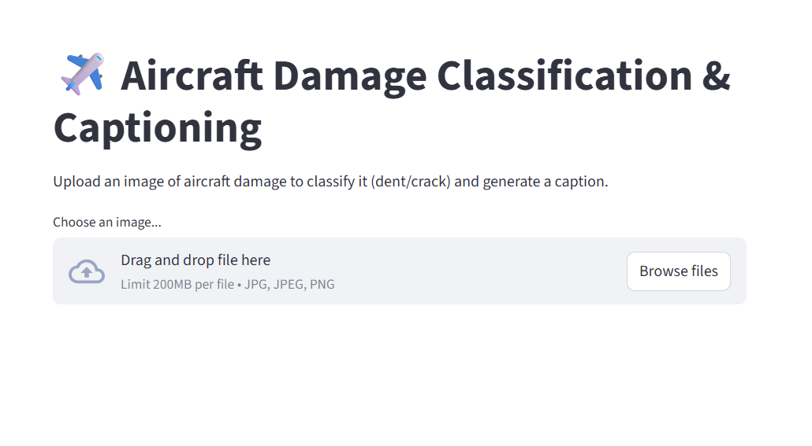
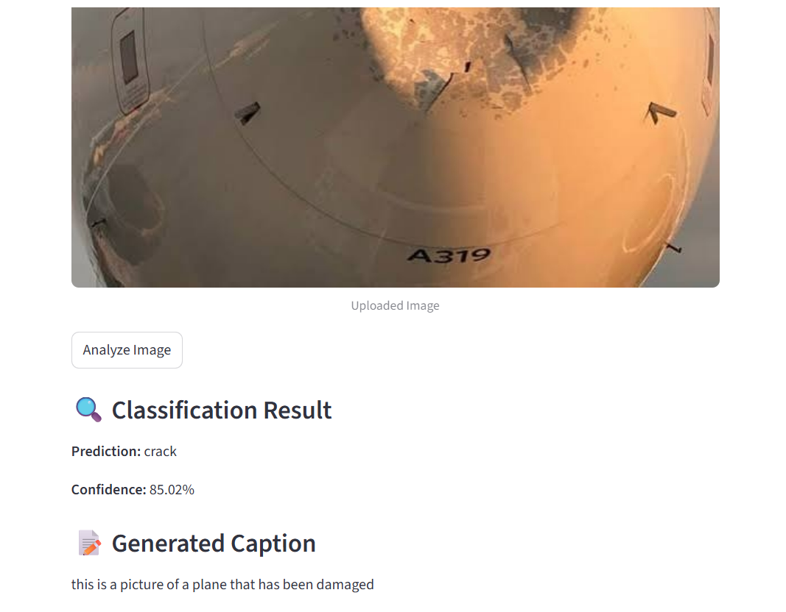
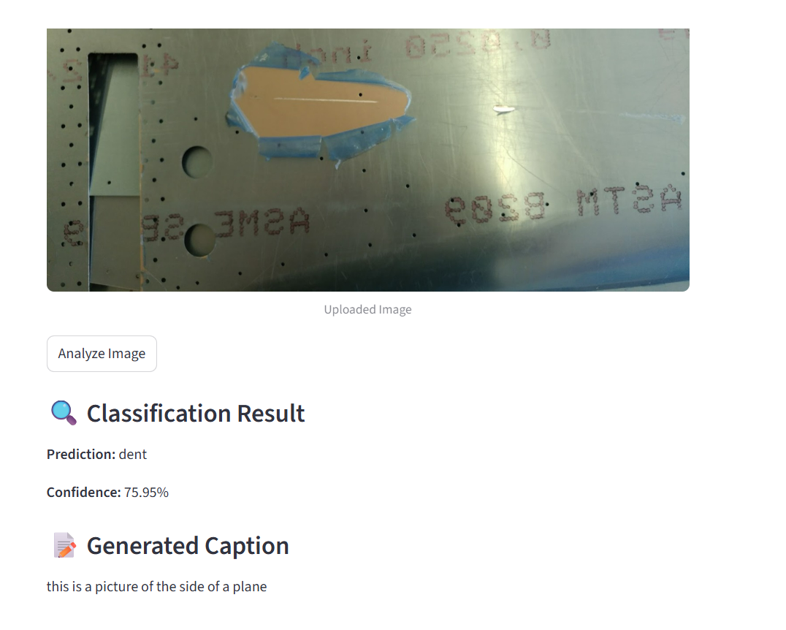

# ✈️ Aircraft Damage Classification & Captioning using Pretrained Models

An intelligent aircraft inspection system that combines **Transfer Learning** for aircraft damage classification and **Vision-Language Models (BLIP)** for automatic image caption generation.

---

# 📸 Demo

## 🏠 Home Page

<p align="center">
  
</p>

---

## 🔍 Crack Prediction Example

<p align="center">
  
</p>

---

## 🔍 Dent Prediction Example

<p align="center">
  
</p>

---

# 📌 Overview

Aircraft inspection is a critical process in aviation maintenance. Manual inspection is time-consuming and susceptible to human error.

This project automates the inspection process using **Deep Learning** and **Transfer Learning**, enabling the system to:

- Detect aircraft damage type (**Dent** or **Crack**)
- Generate a natural language description for the uploaded image
- Provide an interactive Streamlit interface for real-time predictions

The project combines **Computer Vision** and **Vision-Language Models** to simulate an intelligent aircraft inspection assistant.

---

# 🚀 Features

### ✅ Aircraft Damage Classification

- Binary Image Classification
- Damage Classes:
  - Dent
  - Crack

### ✅ Image Caption Generation

- Powered by the pretrained **BLIP Transformer**
- Automatically generates descriptive captions for aircraft damage images

### ✅ Interactive Streamlit Application

- Upload an aircraft image
- Predict damage type
- Display prediction confidence
- Generate image caption instantly

---

# 🧠 Models Used

## Image Classification

- Pretrained **VGG16**
- Transfer Learning
- Feature Extraction
- TensorFlow / Keras

## Image Captioning

- BLIP (Bootstrapping Language Image Pretraining)
- Hugging Face Transformers

---

# 📂 Project Structure

```text
Aircraft-Damage-Classification-and-Captioning
│
├── app.py
├── Final-Project-Classification-and-Captioning.ipynb
├── requirements.txt
├── README.md
│
├── images
│   ├── Image1.png
│   ├── Image2.png
│   └── Image3.png
│
└── aircraft_damage_model.h5
```
## 📝 Repository Notes

- The training dataset is not included in this repository due to its large size and licensing considerations.
- The trained model (`aircraft_damage_model.h5`) is excluded because it exceeds GitHub's file size limit (100 MB).
- To reproduce the results, users can train the model using the provided Jupyter Notebook.
---

# ⚙️ Technologies

- Python
- TensorFlow
- Keras
- VGG16
- Hugging Face Transformers
- BLIP
- Streamlit
- NumPy
- Pillow

---

# 📊 Workflow

1. Upload an aircraft image
2. Preprocess the image
3. Extract features using pretrained VGG16
4. Classify the damage:
   - Dent
   - Crack
5. Calculate prediction confidence
6. Generate an image caption using BLIP
7. Display the results in the Streamlit application

---

# 💻 Streamlit Application

The application provides:

- Aircraft image upload
- Damage classification
- Prediction confidence score
- Automatic image caption generation

---

# 📈 Applications

- Aircraft Maintenance
- Automated Inspection Systems
- Aviation Safety
- Computer Vision
- Industrial AI

---

# 📚 Concepts Covered

- Deep Learning
- Transfer Learning
- Image Classification
- Computer Vision
- Vision Transformers
- Image Captioning
- Feature Extraction
- Pretrained Models

---

# 🔮 Future Improvements

- Multi-class damage classification
- Object Detection for damage localization
- Damage severity estimation
- Damage segmentation
- Cloud deployment
- Explainable AI (Grad-CAM)

---

# 👩‍💻 Author

**Fatma Sherif**

Computer Science Student

Interested in Artificial Intelligence and Data Science.
